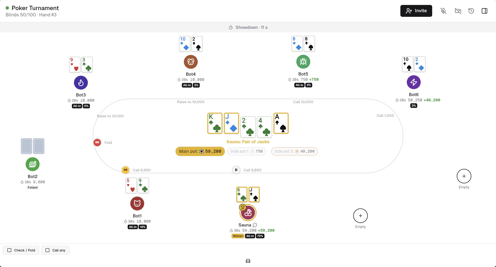

# Showdown

Self-hosted Texas Hold'em (No-Limit) for private groups: a Go API and a Flutter web
client, deployed with a single `docker compose up`. Anyone on your instance can create a
table and becomes its host; the host shares the link, players join with a display name in
the browser. Everything runs on your own server, and the app makes no external requests
at all. The web client is compiled to WebAssembly (with a JavaScript fallback for
older browsers).



Poker rules: `docs/rules.md`. Wire protocol: `docs/protocol.md`.

## Quick start

```
cp .env.example .env        # optional: change the port or limits
docker compose up --build   # open http://localhost:8080
```

Then open `http://localhost:8080`, create a table and share the link (the **Invite**
button at the table copies it and shows a QR code) with your group. Players open the link, pick a name and play. Reloading the page or
losing the connection brings a player back to their seat.

## Hosting a table

There is no admin account. Whoever creates a table is its host: the browser that created
it stores an **admin key** for that table, and the host sees an **Admin** tab at the table
with the settings, Start / Pause / End, player management (kick, chips, mute), chat
moderation and the recent hands. The key is shown in that tab; copy it to manage the
table from another device or browser (the join page has an "I host this table" field).
Anyone who has the key can manage the table, so share it only with co-hosts.

Table creation is limited per address (5 per minute) and by `MAX_TABLES`. Ended tables
keep their final standings and hand history until `TABLE_RETENTION_DAYS` passes.

The stack is two containers: `web` (Caddy serving the Flutter build and proxying
`/api/*` and `/ws/*`) and `api` (the Go server, reachable only inside the compose
network). Game data lives in the `data` volume (a single SQLite file).

## Configuration (`.env`)

| Variable | Default | Meaning |
|---|---|---|
| `WEB_PORT` | `8080` | host port published by `web` |
| `SITE_ADDRESS` | `:80` | Caddy site address; a host name enables auto-HTTPS (see below) |
| `TABLE_RETENTION_DAYS` | `90` | hands and chat of ended tables are deleted after this many days; the tables and their final standings are kept |
| `MAX_TABLES` | `100` | cap on tables that have not ended |
| `VOICE_STUN_URLS` | empty | STUN servers for the voice chat across networks, comma-separated (`stun:` / `stuns:`); empty keeps voice within one network and avoids any third party |
| `IMAGE_OWNER` | `owner` | only for pulling/publishing prebuilt images |

More API settings can be added to the `api` service environment:
`MAX_CONNECTIONS_PER_IP` (default 50), `TRUST_PROXY` (`true`: use `X-Forwarded-For`
from the proxy for rate limiting), `LOG_LEVEL` (`info`) and `LOG_FORMAT` (`json` or
`text`).

## Prebuilt images (Portainer, small servers)

Building the web image compiles the Flutter app and needs network access to
github.com and storage.googleapis.com plus about 2 GB of disk and a few minutes of CPU.
Stack tools such as Portainer build on the server, where that often fails or times out.
Use the published images instead:

1. Push a release tag (`v1.0.0`) to GitHub; the CI publishes
   `ghcr.io/<owner>/showdown-api` and `ghcr.io/<owner>/showdown-web`. Make both packages
   public in the GitHub package settings.
2. Deploy `deploy/docker-compose.prebuilt.yml` (in Portainer: repository stack, compose
   path `deploy/docker-compose.prebuilt.yml`) with `IMAGE_OWNER=<owner>` and optionally
   `IMAGE_TAG=v1.0.0` in the environment. It has no `build:` sections, so nothing is
   compiled on the server.

The proxy override below works with it too:
`COMPOSE_FILE=deploy/docker-compose.prebuilt.yml:deploy/docker-compose.proxy.yml`.

## Behind an existing reverse proxy (Dokploy, Traefik, nginx, Caddy)

Point your proxy at the `web` container on port 80 and leave `SITE_ADDRESS=:80`. Your
proxy terminates TLS; `web` keeps serving plain HTTP internally. WebSockets must be
forwarded for `/ws/*` (Traefik and Caddy do this by default; for nginx add the usual
`Upgrade`/`Connection` headers). With Dokploy, deploy the repository as a compose
application and expose service `web`, port 80.

If your proxy already runs in its own Docker network (say `proxy-network`), attach
`web` to it instead of publishing a port. Put this in `.env`:

```
PROXY_NETWORK=proxy-network
COMPOSE_FILE=docker-compose.yml:deploy/docker-compose.proxy.yml
```

Then `docker compose up -d` as usual: `web` joins that network and publishes no port,
`api` stays on the stack's private network. Point the proxy at the `web` container on
port 80 (Traefik: `traefik.http.services.showdown.loadbalancer.server.port=80`). The
network must already exist (`docker network create proxy-network` if it does not).

Rate limiting uses `X-Forwarded-For` (`TRUST_PROXY=true`), which Caddy sets from the
real client address. If `web` is directly on the internet, that header comes from Caddy
itself and is trustworthy as well.

## Standalone with automatic HTTPS

If nothing sits in front of the stack and ports 80/443 are reachable from the internet:

```
SITE_ADDRESS=poker.example.com   # in .env
docker compose -f docker-compose.yml -f deploy/docker-compose.tls.yml up -d --build
```

Caddy obtains and renews the certificate; the override publishes ports 80 and 443 and
adds volumes for the certificates.

## Operations

- `docker compose logs -f` shows both services (JSON logs from the API).
- Backups: stop the stack or copy the `data` volume while it runs (SQLite WAL is
  crash-safe; a consistent snapshot is easiest with `docker compose down` first).
- Updates: `docker compose pull && docker compose up -d` with prebuilt images, or
  `docker compose up -d --build` from source. Migrations run at API start.
- A restart voids the hand that was in progress (stacks return to the hand's start),
  players reconnect into their seats with their stored tokens.

## At the table

Players pick an avatar and, if they like, a seat when joining. At the table: a
coins/big-blinds toggle for all amounts, a "your turn" strip with the remaining time and
a sound cue, pre-actions (check/fold, call any) while waiting, a warning when folding a
free check, the current hand's name from the deal on, showing one card or both after an
uncontested win, rabbit hunting when the host allows it, and a step-by-step replay of any
hand from the Log tab. Hosts can raise the blinds on a schedule or on demand.

**Voice chat** is browser-to-browser (WebRTC); the server only relays the connection
setup and never carries audio. Players opt in when joining or from the table's drawer,
and can mute themselves with the microphone badge next to their avatar. Browsers only
grant the microphone on HTTPS or `localhost`, so over a plain `http://<ip>:8080` link
voice stays off; use the TLS setup below or a reverse proxy with a certificate. Without
a STUN server it works between devices on the same network; set `VOICE_STUN_URLS` (for
example a public STUN server) to let browsers behind different routers find each other.
A STUN server only answers "what is my public address", it never carries audio.

## Leaderboards

Each table has its own leaderboard (in the side panel, and the final standings when the
table ends), visible only to the people at that table. There is no instance-wide
leaderboard: display names are chosen freely per table and are not identities.

## Development

```
make dev-api     # Go API on :8080 with CORS for the dev web server
make dev-web     # flutter run in Chrome on :3000
make lint test check-gen
make bots TABLE=<id> [PASSWORD=...]   # six scripted players
```

Load test (20 tables x 9 bots against the api capped at 1 vCPU / 512 MB, reports the
action-to-snapshot latency distribution and fails when p95 exceeds 100 ms):

```
docker compose -f docker-compose.yml -f deploy/docker-compose.loadtest.yml up -d
make loadtest        # LOAD_TABLES, LOAD_BOTS, LOAD_DURATION override the defaults
docker compose up -d # back to the normal stack (api no longer published)
```

Single process by design: one table is one goroutine; there is no horizontal scaling.
